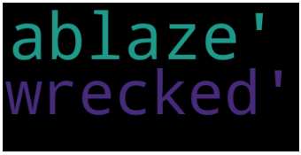
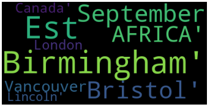
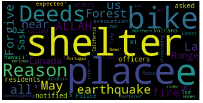
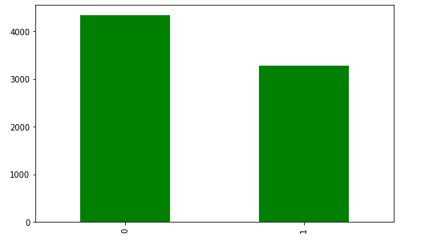
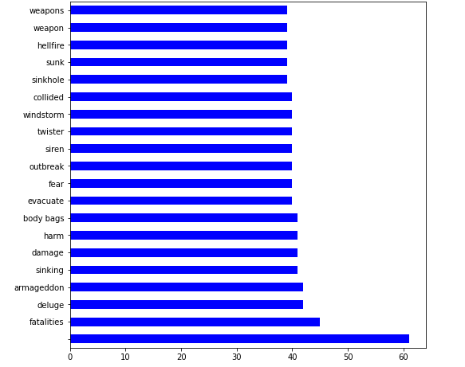
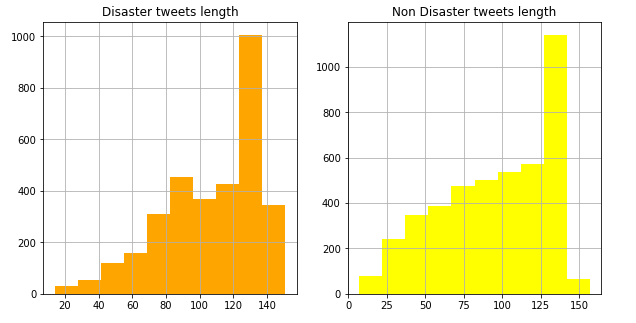
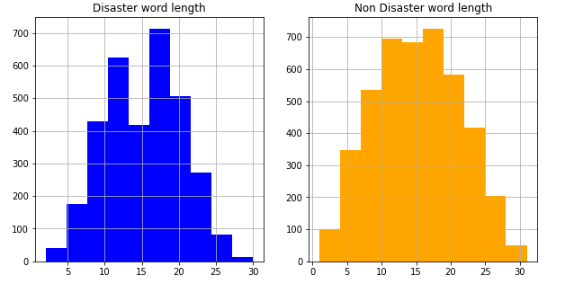

# nlp-getting-started

Модель машинного обучения, которая предсказывает, какие твиты посвящены реальным бедствиям, а какие нет.

## Cloud of words

### Keywords

    </a>

### Locations

    </a>

### Text

    </a>

## EDA

### Target and not target records count

    </a>

### Keywords statistics

    </a>

### Locations statistics

    </a>

### Disaster and Non Disaster tweets length

    </a>

### Disaster and Non Disaster word length

    </a>

## Methods description

### CountVectorize

В данном подходе входные данные токенизируются и представляются в виде словаря. 
А затем документ представляется, используя этот словарь.

У CountVectorize есть несколько параметров:
- max_features — построенный словарь будет содержать только n самых часто встречающихся в корпусе токенов, отсортированных по частоте.
- min_df — при построении словаря будут игнорироваться слова из текстов, частота которых строго ниже заданного порогового значения.
- max_df — при построении словаря будут игнорироваться слова из текстов, частота которых строго выше заданного порогового значения.

### TF-IDF

Подход чем то похож на CountVectorize, только здесь для каждого токена используется метрика
TF-IDF. 

- Частота слова (Term Frequency) — подсчитывает, как часто выбранное слово появляется в документе.

- Обратная частота документа (Inverse Document Frequency) — снижает вес слов, которые часто встречаются в документах.

### GloVe

GloVe (global vectors for word representation) означает «глобальные векторы для представления слов».
Это алгоритм обучения без учителя, разработанный в Стэнфорде.
Основная его идея состоит в том, чтобы извлечь семантические отношения между словами используя матрицу совместного использования.
Каждый класс в модели представляет собой слово и соответствующий ему n-мерный вектор.

### BERT

Слова также представлены в виде векторов, но теперь учитывается и контекст. 
Многозначные слова кодируются разными векторами в зависимости от контекста, в котором они применялись.

### Про метрики
Для данной задачи наиболее интересны метрики Recall и Roc Auc Score. Ведь нам важно определить 
как можно больше бедствий из твитов, и не так страшно, если какой то твит будет опознан ложно положительно.
Ведь страшнее не узнать о катастрофе, чем получить ложную тревогу.

# Вывод

В ходе работы были изучены такие способы классификации текста, как CountVectorize, TF-IDF, GloVe, BERT. Наиболее глубокой моделью является BERT, так как учитывается не только вес слов в тексте, но и их контекст, в отличие от остальных моделей.
Сама модель в работе была обучена при помощи логистической регрессии на основе векторов TF-IDF. Наиболее выжными метриками для нас являлись Recall и Roc Auc Score, так как нам важней не упусить бедствия из виду, нежели получить ложные срабатывания.
