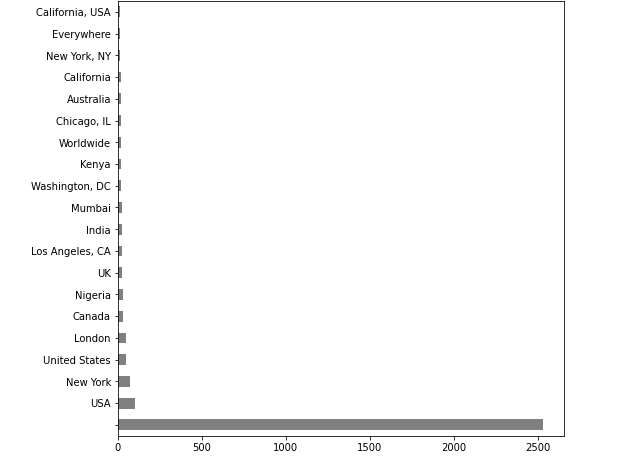

# nlp-getting-started

Модель машинного обучения, которая предсказывает, какие твиты посвящены реальным бедствиям, а какие нет.

## Cloud of words

### Keywords

    </a>

### Locations

    </a>

## EDA

### Target and not target records count

    </a>

### Keywords statistics

    </a>

### Locations statistics

    </a>

### Disaster and Non Disaster tweets length

    </a>

### Disaster and Non Disaster word length

    </a>

## Methods description

### CountVectorize

Convert a collection of text documents to a matrix of token counts.

### TF-IDF

Count Vectorizer give number of frequency with respect to index of vocabulary where as tf-idf consider overall documents of weight of words

### GloVe

GloVe stands for global vectors for word representation. It is an unsupervised learning algorithm developed by Stanford for generating word embeddings by aggregating global word-word co-occurrence matrix from a corpus. The resulting embeddings show interesting linear substructures of the word in vector space.

### BERT

Splitting a word into a vector of 32 numbers. Search for suitable words by measuring the distance between the axes of vectors